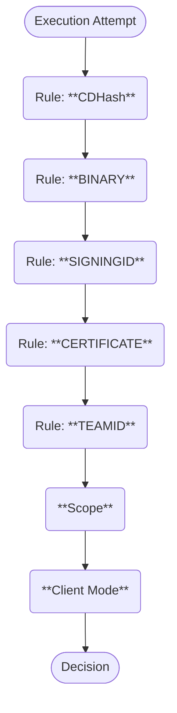

import AddedBadge from "@site/src/components/AddedBadge/AddedBadge";

# Binary Authorization

Binary authorization, also known as binary allowlisting (and formerly, binary
whitelisting) is a feature that lets Santa control which binaries are run on
the same machine. This is a powerful control for both security and policy
enforcement.


With Santa running, any time a binary is executed on the machine, Santa will
decide whether the binary is allowed to be executed.

- If the execution is allowed, everything will proceed as normal and Santa
  will cache its decision so that subsequent executions can avoid repetitive
  processing and execute faster.

- If the execution is denied, Santa optionally presents a GUI notification over
  the top of any other windows detailing what was blocked.

Santa supports multiple mechanisms for controlling which executables are allowed
to run, with as little friction as possible.

## Rules

The primary mechanism for deciding what is able to run is **Rules**. Rules can
be synchronized from a server, configured statically in a profile, or managed
locally with `santactl`.

### Rule Types

Santa supports several different rule types and follows a strict evaluation
order when determining which rule to enforce for a given execution. The
following diagram shows Santa's rule precedence:

<div class="text--center">



</div>

#### CDHash

Value: `CDHASH`

CDHash rules use a binary’s signed code directory hash as an identifier. This is
the most specific rule in Santa. The code directory hash identifies a specific
version of a program, similar to a file hash. Note that the operating system
evaluates the CDHash lazily, only verifying pages of code when they’re mapped
in. This means that it is possible for a file hash to change but a binary could
still execute as long as modified pages are never mapped in.

Santa only considers CDHash rules for processes that run under Apple's [Hardened
Runtime](https://developer.apple.com/documentation/security/hardened-runtime),
to ensure that a process will be killed if the CDHash was tampered with
(assuming the system has SIP enabled).

#### Binary

Value: `BINARY`

Binary rules use the SHA-256 hash of the entire binary file as an identifier.
This means that if the binary file is tampered with in any way then the rule
will not match.

#### SigningID

Value: `SIGNINGID`

Signing IDs are arbitrary identifiers under developer control that are given to
a binary at signing time. Typically, these use reverse domain name notation and
include the name of the binary (e.g. `com.google.Chrome`).

Because the signing IDs are arbitrary, the Santa rule identifier must be
prefixed with the Team ID associated with the Apple developer certificate used
to sign the application. For example, a signing ID rule for Google Chrome would
be: `EQHXZ8M8AV:com.google.Chrome`. For platform binaries (i.e. those binaries
shipped by Apple with the OS) which do not have a Team ID, the string `platform`
must be used (e.g. `platform:com.apple.curl`). The `santactl fileinfo` command
can be used to help find this information:

```shell
» santactl fileinfo /Applications/Santa.app
Path                   : /Applications/Santa.app/Contents/MacOS/Santa
SHA-256                : 66acf5c808ddb86c10137b5ae4c72cd14985ed2f90e5850d8e26ab962cb93c70
SHA-1                  : 259f6b0ffc9cccc069eab2aee1496f5a12072ee7
Bundle Name            : Santa
Bundle Version         : 2025.3.97
Bundle Version Str     : 2025.3
Team ID                : ZMCG7MLDV9
# highlight-next-line
Signing ID             : ZMCG7MLDV9:com.northpolesec.santa
CDHash                 : ea7c2330699c760b2d6c2c3e703fde01ca54e9b4
Type                   : Executable (arm64, x86_64)
Code-signed            : Yes
Rule                   : Allowed (SigningID)
```

:::note

`SIGNINGID` rules only apply to applications signed with a production certificate.

To target code signed with a development certificate, you can use:
- A [`CDHASH`](#cdhash) or [`BINARY`](#binary) rule to target a specific executable
- A [`CERTIFICATE`](#certificate) rule to target a broader set of applications

:::

#### Certificate

Value: `CERTIFICATE`

Certificate rules are formed from the SHA-256 fingerprint of an X.509 leaf
signing certificate. This is a powerful rule type that has a much broader reach
than an individual binary rule. A signing certificate can sign any number of
binaries. Allowing or blocking just a few key signing certificates can cover the
bulk of an average user’s binaries. The leaf signing certificate is the only
part of the chain that is evaluated. Though the whole chain is available for
viewing.

Santa does not evaluate the Valid From or Valid Until fields, nor does it check
the Certificate Revocation List (CRL) or the Online Certificate Status Protocol
(OCSP) for revoked certificates. Adding rules for the certificate chain’s
intermediates or roots has no effect on binaries signed by a leaf. Santa
ignores the chain and is only concerned with the leaf certificate’s SHA-256
hash.

```shell
» santactl fileinfo /Applications/Santa.app
Path                   : /Applications/Santa.app/Contents/MacOS/Santa
SHA-256                : 66acf5c808ddb86c10137b5ae4c72cd14985ed2f90e5850d8e26ab962cb93c70
SHA-1                  : 259f6b0ffc9cccc069eab2aee1496f5a12072ee7
Bundle Name            : Santa
Bundle Version         : 2025.3.97
Bundle Version Str     : 2025.3
Team ID                : ZMCG7MLDV9
Signing ID             : ZMCG7MLDV9:com.northpolesec.santa
CDHash                 : ea7c2330699c760b2d6c2c3e703fde01ca54e9b4
Type                   : Executable (arm64, x86_64)
Code-signed            : Yes
Rule                   : Allowed (SigningID)
Signing Chain:
# highlight-next-line
    1. SHA-256             : 1afd16f5b920f0d3b5f841aace6e948d6190ea8b5156b02deb36572d1d082f64
       SHA-1               : 42890bc8a2a8becda00d63bdf9a89a6756a0da49
       Common Name         : Developer ID Application: North Pole Security, Inc. (ZMCG7MLDV9)
       Organization        : North Pole Security, Inc.
       Organizational Unit : ZMCG7MLDV9
       Valid From          : 2024/10/11 21:24:15 -0400
       Valid Until         : 2027/02/01 17:12:15 -0500

    2. SHA-256             : 7afc9d01a62f03a2de9637936d4afe68090d2de18d03f29c88cfb0b1ba63587f
       SHA-1               : 3b166c3b7dc4b751c9fe2afab9135641e388e186
       Common Name         : Developer ID Certification Authority
       Organization        : Apple Inc.
       Organizational Unit : Apple Certification Authority
       Valid From          : 2012/02/01 17:12:15 -0500
       Valid Until         : 2027/02/01 17:12:15 -0500

    3. SHA-256             : b0b1730ecbc7ff4505142c49f1295e6eda6bcaed7e2c68c5be91b5a11001f024
       SHA-1               : 611e5b662c593a08ff58d14ae22452d198df6c60
       Common Name         : Apple Root CA
       Organization        : Apple Inc.
       Organizational Unit : Apple Certification Authority
       Valid From          : 2006/04/25 17:40:36 -0400
       Valid Until         : 2035/02/09 16:40:36 -0500
```

#### TeamID

Value: `TEAMID`

The Apple Developer Program Team ID is a 10-character identifier issued by Apple
and tied to developer accounts/organizations. This is distinct from
Certificates, as a single developer account can and frequently will
request/rotate between multiple different signing certificates and entitlements.

This is an even more powerful rule with broader reach than individual
certificate rules and should be used with care.

:::note

`TEAMID` rules only apply to applications signed with a production certificate.

To target code signed with a development certificate, you can use:
- A [`CDHASH`](#cdhash) or [`BINARY`](#binary) rule to target a specific executable
- A [`CERTIFICATE`](#certificate) rule to target a broader set of applications

:::

```shell
» santactl fileinfo /Applications/Santa.app
Path                   : /Applications/Santa.app/Contents/MacOS/Santa
SHA-256                : 66acf5c808ddb86c10137b5ae4c72cd14985ed2f90e5850d8e26ab962cb93c70
SHA-1                  : 259f6b0ffc9cccc069eab2aee1496f5a12072ee7
Bundle Name            : Santa
Bundle Version         : 2025.3.97
Bundle Version Str     : 2025.3
# highlight-next-line
Team ID                : ZMCG7MLDV9
Signing ID             : ZMCG7MLDV9:com.northpolesec.santa
CDHash                 : ea7c2330699c760b2d6c2c3e703fde01ca54e9b4
Type                   : Executable (arm64, x86_64)
Code-signed            : Yes
Rule                   : Allowed (SigningID)
```

### Policies

Once a rule has been found that matches a given executable, the action to take
is based on the policy attached to the rule. Santa supports several policies.

#### Allowlist

Value: `ALLOWLIST`

The binary is allowed to execute and this decision is cached such that
subsequent executions of the same binary will not be processed to increase
performance.

#### Allowlist Compiler

Value: `ALLOWLIST_COMPILER`

If Santa is configured to
[enable transitive allowlisting](https://northpole.dev/configuration/keys#EnableTransitiveRules)
then the binary is allowed to execute and any files that it writes will be
read upon closing (or renamed) to check whether they are Mach-O binaries.

When a Mach-O binary has been written by an allowed compiler, a transitive rule
will be created for it that is valid for 6 months. This rule will allow that
binary only on the machine that it was created on.

The purpose of transitive allowlisting is to allow developers to live in
Lockdown mode while still being able to do local development. Allowlisting the
final process in a build toolchain (usually a linker or the `codesign` tool)
will usually allow developers to work as normal.

:::note

While Santa tries to ensure all files created by allowlisted compilers are
scanned and transitive rules created as quickly as possible, there is a race
condition in certain scenarios that will cause execution to fail, especially if
a binary is executed _immediately_ after being created.

:::

If transitive allowlisting is _not_ enabled, the rule will be treated as if it
were a regular [Allowlist](#allowlist) rule.

#### Blocklist

Value: `BLOCKLIST`

The execution will be blocked. This will be the case even if the host is in
Monitor or Standalone mode, and it will not be possible to override.

Blocklist rules are intended to block applications that an organization deems
to be malicious or against policy. Rules can have custom messages attached to
them, which override the default message shown when Santa blocks an application.
This can be used in Blocklist rules to inform users _why_ a particular
application is blocked.

#### Silent Blocklist

Value: `SILENT_BLOCKLIST`

Silent Blocklist rules are identical to normal Blocklist rules but the GUI will
not be displayed when such a rule is triggered.

This rule type should be used sparingly. Blocking an application without
informing the user that it was Santa that did it can be a _very_ confusing
experience for users and lead to wasted time trying to determine the underlying
cause.

#### CEL <AddedBadge added={"2025.6"} /> {#cel}

Value: `CEL`

CEL (Common Expression Language) rules allow for more complex policies than
would normally be possible. A rule with this policy must also include a valid
[CEL expression](https://cel.dev/) which will be evaluated as part of making a
decision.

The input to the expression will be an
[santa.cel.v1.ExecutionContext](https://github.com/northpolesec/protos/blob/704246489aa55e6e2b60b47133a8668bc3656105/cel/v1.proto#L42)
and the return value must either be a
[santa.cel.v1.ReturnValue](https://github.com/northpolesec/protos/blob/704246489aa55e6e2b60b47133a8668bc3656105/cel/v1.proto#L20)
or a bool. If the return value is a bool, true will be treated as a
`ReturnValue.ALLOWLIST` and false will be treated as `ReturnValue.BLOCKLIST`.

The accessed fields in the `ExecutionContext` will determine whether the result
of the expression can be cached. This is very important to be aware of, as
overuse of CEL rules that prevent caching can have a negative impact on system
performance, especially for binaries that are executed frequently.

Some examples of valid CEL expresssions:

```clike
// Only allow executing versions of an app signed on or after May 31st 2025.
// This expression will be cacheable.
target.signing_time >= timestamp('2025-05-31T00:00:00Z')

// Prevent using the --inspect flag.
// This expression will NOT be cacheable.
'--inspect' in args ? BLOCKLIST : ALLOWLIST

// Block all executions with DYLD_INSERT_LIBRARIES environment variable set.
// This expression will NOT be cacheable.
! has(envs.DYLD_INSERT_LIBRARIES)
```

## Rule Layering

Since Santa is a first match system, there are some interesting ways you can
layer rules to achieve different policies.

For example if you want to allow all applications from a publisher (e.g. the
Acme software company) you might start with an allow rule for the TeamID
(ABCDEF1234) to allow all applications from that publisher.

However if you then need to prevent a specific cloud-storage application
written by the same provider, you can then use a higher precedence SigningID
rule to block that company’s cloud storage product.

Using `santactl` this would look like the following:

```
santactl rule --allow --teamid --identifier ABCDEF1234

santactl rule --block \
              --signingid \
              --identifier ABCDEF1234:com.acme-example.cloud-storage
```

You could also do the inverse and block everything by a publisher but allow a
specific application by having a TeamID block rule and a SigningID allow
rule.

For example if you instead wanted to block everything from the Acme company
except for the company's cloud storage product you'd make a TeamID block rule
for `ABCDEF1234` and a SigningID allow rule for the specific cloud storage
product.

Using `santactl` this would look like the following:

```
santactl rule --block --teamid --identifier ABCDEF1234

santactl rule --allow \
              --signingid \
              --identifier ABCDEF1234:com.acme-example.cloud-storage
```

## Scope

In addition to rules, Santa can allow or block based on scopes. Currently, only
a few scopes are implemented. Scopes are evaluated after rules, with block
evaluation preceding allow.

| Scope                    | Allow/Block | Configurable                                            | Description                                                                                                                 |
| ------------------------ | ----------- | ------------------------------------------------------- | --------------------------------------------------------------------------------------------------------------------------- |
| Blocked Path Regex       | Block       | [Yes](/configuration/keys#BlockedPathRegex)             | A regex which the binary path is executed from is matched against. If the path matches the regex, the execution is blocked. |
| Bad Signature Protection | Block       | [Yes](/configuration/keys#EnableBadSignatureProtection) | If enabled, a binary that is executed with a bad signing chain will be blocked.                                             |
| Allowed Path Regex       | Allow       | [Yes](/configuration/keys#AllowedPathRegex)             | A regex which the binary path is executed from is matched against. If the path matches the regex, the execution is allowed. |
| Not a Mach-O             | Allow       | No                                                      | Files which are not Mach-O binaries are ignored.                                                                            |

:::note[A note about scripts]

We understand that the ability to manage the execution of "scripts" is desirable
but unfortunately this is not currently feasible to implement:

1. In the event that a script is executed directly (e.g. `./foo.sh`) it is
   possible to implement authorization of these scripts. However, doing so would
   require Santa to disable a layer of caching because otherwise any script that
   uses an interpreter that has already been authorized to run would bypass the
   authorization step. This would harm performance, quite significantly.

2. It would be very trivial to bypass the control above, for example by passing
   the name of the script directly to the interpreter (e.g. `/bin/sh foo.sh`).
   Protecting against this would require Santa to parse all of the command-line
   arguments passed to an interpreter and there are many possible interpreters.

3. Further to the above, many interpreters support passing commands directly
   (e.g. `/bin/bash -c`) or executing a script passed on standard input (e.g.
   `echo foo.sh | /bin/bash`).
   :::

:::danger[Warning: `AllowedPathRegex` and `BlockedPathRegex`]

While there are legitimate use-cases for using `AllowedPathRegex` and
`BlockedPathRegex`, we **strongly** discourage their use because they create an
extremely simple bypass of Santa's protection.

It's also important to understand that a binary that is executed from a path
covered by an `AllowedPathRegex` will be cached, such that if it is later moved
into a path that is not covered by the regex, it will still be allowed to
execute.

:::

## Client Mode

If Santa hasn't made a decision based on existing Rules or due to a scope, the
action that is taken depends on what mode Santa is running in. In
event/telemetry output this is the `UNKNOWN` case:

- Monitor: All unknown executions are allowed.

- Lockdown: All unknown executions are blocked.

- Standalone: All unknown executions are held until the user approves them,
  either by using TouchID or entering their password. If they approve the
  execution the execution is allowed to continue (without requiring
  re-execution) and a local SigningID or SHA-256 rule is automatically created.
