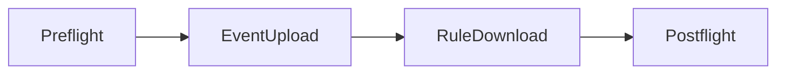

# Sync Servers

Santa can be configured to synchronize with a central server, to control the
rules that Santa applies, the settings that apply to the host, and to upload
details about executions that have been blocked.

Using Santa with a large fleet of machines is greatly simplified with a sync
server involved. With a sync server configured, local rule management with
the `santactl rule` command is disabled.

## Protocol Overview

Santa's sync protocol is a simple HTTP protocol using [protobuf request/response
messages](https://buf.build/northpolesec/protos/docs/main:santa.sync.v1).

By default, Santa will send its request/responses in JSON form as this was
historically all that was supported. The
[SyncEnableProtoTransfer](/configuration/keys#SyncEnableProtoTransfer)
key can be used to enable binary proto transfers, which is faster to parse and
uses less bandwidth to transfer.

## Sync Flow

When syncing is configured, a process called `santasyncservice` runs in the
background and periodically triggers a sync.

A single sync is split into multiple stages, each responsible for something
different and the stages run in order:

- `Preflight` and `Postflight` stages are required and occur on every sync.
- `EventUpload` may be skipped if there are no events to upload.
- `RuleDownload` is required.

If any request to the server fails, or the server responds to a request with a
response other than `200 OK` then the client may attempt to repeat the request
up to 5 times. If none of these requests succeeds, or the original response
indicates that a retry is not worth attempting then the client will abandon the
sync and not move on to the next stage. If the failure occurs before the
`Postflight` request, then any settings that were received in the
`Preflight` will be reverted. If the `RuleDownload` stage had succeeded then
no reversion of rules will be done.

### Preflight

During `Preflight`, Santa sends data about the host (serial number, hostname, OS
version, model, etc.) and its Santa configuration (current rule counts) to the
server.

The server can respond with many configuration settings for the client to apply,
including the client mode, the event batch size, whether to enable transitive
rules, Mountable Removable Media (e.g. USB device) blocking configuration, etc.

The full
[request](https://buf.build/northpolesec/protos/docs/main:santa.sync.v1#santa.sync.v1.PreflightRequest)
and
[response](https://buf.build/northpolesec/protos/docs/main:santa.sync.v1#santa.sync.v1.PreflightResponse)
messages are documented at buf.build.

### Event Upload

During `EventUpload`, Santa sends data about execution events that the server
may need to know about. The primary purpose of `EventUpload` is to upload
information about executions that Santa has blocked so that a server may
possibly take action. Given this purpose, Santa will only upload events for
executions that were blocked or executions that _would_ have been blocked if
Santa is running in `MONITOR` mode.

When there are events to upload, the client will batch events based on the
`batch_size` field set in the Preflight response (or 50, if the server never
sets a batch size). If there are more events to upload than the batch size, then
the client will make multiple requests until it runs out of events to upload. If
the client has no events to upload, no EventUpload request will be made.

:::tip

Santa will only upload an event for executions when it makes an active uncached
decision. As Santa caches allowed executions aggressively, this implies that
events for executions that were allowed will be infrequent.

:::

It is possible to control which events are uploaded with the
[EnableAllEventUpload](/configuration/keys#EnableAllEventUpload)
and
[DisableUnknownEventUpload](/configuration/keys#DisableUnknownEventUpload)
configuration options.

The full
[request](https://buf.build/northpolesec/protos/docs/main:santa.sync.v1#santa.sync.v1.EventUploadRequest)
and
[response](https://buf.build/northpolesec/protos/docs/main:santa.sync.v1#santa.sync.v1.EventUploadResponse)
messages are documented at buf.build.

### Rule Download

During `RuleDownload`, Santa downloads rules from the server and stores them in
its local database ready for future execution requests.

Rules are generally expected to be applied progressively, so that the server
doesn't have to send the full set of rules on every sync. Instead, each time a
client initiates a sync, the server should send only the rules that have been
created/updated since the last time the client synced. Rules are applied in
the order they are received, so a rule of a given type and identifier will
update any existing rule.

To facilitate this progressive application, the server can include a `cursor` in
each RuleDownload response. If this string field is not empty, it signals to the
client that further RuleDownload requests are needed and the cursor is included
in the next request. The server can use this cursor to 'paginate' rules. As the
client downloads these batches of rules, it collects them in memory and then
applies them in a single transaction to the database.

:::note

Santa does not attempt to parse or understand the `cursor` field, it only checks
whether the string is empty or not and if not it makes a further request and
includes the cursor in that request. The format of this field is left up to the
sync server implementor, as long as it serializes to a string.

:::

A caveat to the progressive downloads, is that either the client or the server
can request a [_clean_
sync](https://buf.build/northpolesec/protos/docs/main:santa.sync.v1#santa.sync.v1.SyncType).
When the server tells the client during `Preflight` that it is doing a clean
sync, the client will collect all of the rules from each RuleDownload request as
normal and then apply them after deleting any existing rules. This all happens
within a transaction so the client is never left without any rules, unless the
server responds with an empty rule set.

The full
[request](https://buf.build/northpolesec/protos/docs/main:santa.sync.v1#santa.sync.v1.RuleDownloadRequest)
and
[response](https://buf.build/northpolesec/protos/docs/main:santa.sync.v1#santa.sync.v1.RuleDownloadResponse)
messages are documented at buf.build.

### Postflight

The `Postflight` stage is used by the client to inform the server that it has
successfully finished syncing.

The request indicates how many rules were received and successfully processed.
It is expected that in response to this request the server will record the last
successful sync time for this host.

The full
[request](https://buf.build/northpolesec/protos/docs/main:santa.sync.v1#santa.sync.v1.PostflightRequest)
and
[response](https://buf.build/northpolesec/protos/docs/main:santa.sync.v1#santa.sync.v1.PostflightResponse)
messages are documented at buf.build.
